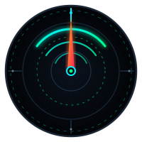

<div align="center">

  

  <h1>Jacobs Issue</h1>

  <p><strong>The PhonoSpatial HUD & Real-Time Acoustic Accessibility Engine: Transforming Environmental Sound into 360° Visual Spatial Intelligence for the Deaf and Hard-of-Hearing.</strong></p>

  <p>
    <a href="https://www.typescriptlang.org/"></a>
    <a href="https://vitejs.dev/"></a>
    <a href="https://react.dev/"></a>
    <a href="https://threejs.org/"></a>
    
    <a href="https://supabase.com/"></a>
    
    
  </p>

</div>

---

## Executive Summary

**Jacobs Issue** is an autonomous assistive perception platform and PhonoSpatial visual HUD engineered for the deaf and hard-of-hearing (DHH) community. For millions of individuals, modern assistive technology remains bottlenecked at linguistic translation—converting speech to text while completely ignoring the critical, spatial acoustic environment. When an emergency siren approaches from behind, a smoke detector triggers in an adjacent hallway, or a baby cries in another room, deaf individuals are left stranded without situational awareness. Traditional alert hardware relies on blunt, monolithic vibration pagers that fail to convey directional bearing, distance, or threat taxonomy.

**Jacobs Issue** dismantles this sensory barrier. Built from the ground up on modern Web Standards, browser-based DSP, and distributed cloud edge runtimes, Jacobs Issue converts raw multi-channel audio streams into a sub-millisecond, 360-degree augmented visual canvas. By combining **Generalized Cross-Correlation with Phase Transform (GCC-PHAT)** Time-Difference-of-Arrival (TDoA) direction finding, **IEC 61672 Class 1** A-weighted sound pressure dosimetry, and edge-native **Sound Event Detection (SED)** neural networks (YAMNet), the platform projects sound as an intuitive spatial vector directly into the user's peripheral field of vision.

Through an integrated Supabase edge fabric, Jacobs Issue operates seamlessly across single-user HUDs and multi-device sensor meshes. When critical threats occur, automated cloud triggers queue immediate emergency dispatches to designated contacts via SMS, email, and webhooks, while generative LLMs synthesize real-time contextual scene narratives—providing comprehensive safety, independence, and spatial presence.

---

## System Architecture & End-to-End Data Pipeline

Jacobs Issue operates as an integrated four-stage sensory pipeline running concurrently across the Web Audio Worklet thread, main client thread, and Supabase serverless edge runtime:

```mermaid
flowchart TB
    subgraph AudioCapture["🎛️ 1. Edge DSP & Direction Finding (Dev 2)"]
        MIC[("Stereo Microphones / AudioInput")] --> WAW["Web Audio Worklet (48 kHz)"]
        WAW -->|Stereo Phase Correlation| GCC["GCC-PHAT TDoA Engine (-90°..+90°)"]
        WAW -->|Biquad Filter Cascade| AWEIGHT["IEC 61672 Class 1 A-Weighting"]
        AWEIGHT --> NOISEFLOOR["Adaptive 10th-Percentile Noise Floor Tracker"]
        WAW -->|FIR Antialias Filter| DECIM["16 kHz Decimator (15,360 Samples / 0.96s)"]
    end

    subgraph EdgeAI["🧠 2. Neural Sound Event Detection (Dev 4)"]
        DECIM --> YAMNET["YAMNet Classifier (TensorFlow.js)"]
        YAMNET --> RISK["Risk Classification Engine (NORMAL | ADVISORY | CRITICAL)"]
    end

    subgraph ClientHUD["🛡️ 3. PhonoSpatial Visual HUD (Dev 1)"]
        GCC -->|Azimuth 0°..360°| TELEM["Telemetry Normalizer & Bus"]
        NOISEFLOOR -->|dB(A) Intensity & Floor| TELEM
        RISK -->|Label & Urgency| TELEM
        TELEM --> CANVAS["360° Canvas 2D Radar Reticle"]
        TELEM --> THREE["Three.js Spatial Depth & Reticle Grid"]
    end

    subgraph Backend["⚡ 4. Cloud Mesh & Ingestion Fabric (Dev 3)"]
        NOISEFLOOR -.->|POST /api/v1/calibration/baseline| BASELINE[("noise_baselines")]
        TELEM -.->|POST /api/v1/devices| DEVICES[("sensor_devices")]
        RISK -.->|POST /api/v1/events| EVENTS[("acoustic_event_logs")]
        EVENTS -->|Replica Identity Full| REALTIME["Supabase Realtime Broadcast (60 FPS)"]
        EVENTS -->|Trigger on_critical_event| QUEUE["notification_dispatch_logs"]
        QUEUE --> DISPATCH["Edge Function: notify-emergency (Gmail / Resend / Webhook)"]
        EVENTS --> LLM["Edge Function: scene-narrative (Gemini AI Synthesis)"]
    end

    REALTIME -.->|Real-time Ingestion / Multi-Client Sync| ClientHUD
```

---

## The Four Engineering Pillars

The architecture of **Jacobs Issue** is strictly modularized across four specialized engineering domains, ensuring clean boundaries, high cohesion, and verifiable contracts:

### 🛡️ Dev 1: PhonoSpatial Visual Engine & 360° HUD
* **Visual Radar Motor:** Ultra-responsive 60 FPS Canvas 2D circular radar with directional vector indicators, dynamic decay trails, and spatial confidence attenuation.
* **Three.js Spatial Depth:** Ambient 3D depth grid, spatial reticle meshes, and perspective-correct visual orientation.
* **Accessible Sensory Design:** High-contrast tactical color palette (Cyan `#00f0ff`, Emerald `#00ff88`, Amber `#ffb020`, Neon Red `#ff1e56`), perimeter danger strobes, and haptic feedback triggers.
* **Authentication & Profiles:** Google OAuth synchronization via `@supabase/supabase-js`, user preference persistence, and zero-configuration offline fallback demo mode.

### 🎛️ Dev 2: Real-Time Web Audio DSP & Direction Finding
* **TDoA Spatial Localization:** GCC-PHAT (Generalized Cross-Correlation with Phase Transform) sub-sample interpolation between dual microphones, mapping physical phase shifts into precise angular azimuths ($-90^\circ \dots +90^\circ \longrightarrow 0^\circ \dots 360^\circ$).
* **A-Weighted Dosimetry:** Certified IEC 61672 Class 1 biquad filter cascade evaluated against international acoustic standards ($\pm 1\text{ dB}$ across $31.5\text{ Hz} - 8\text{ kHz}$).
* **Adaptive Noise Floor:** Moving 10th-percentile tracker over a 5-second sliding window that dynamically discards transient spikes, establishing stable background baselines.
* **True Stereo Inspection:** Verifies sample-level inter-channel decorrelation to detect and handle mono microphone fallbacks without fabricating phantom spatial vectors.
* **Antialiased Downsampling:** High-rejection FIR low-pass filter ($-89\text{ dB}$ attenuation at $15\text{ kHz}$) delivering $15,360$ mono float32 frames at $16\text{ kHz}$ directly to Dev 4's classifier.

### ⚡ Dev 3: Edge Infrastructure, Realtime Ingestion & Emergency Dispatch
* **Serverless Deno Router (`api-v1`):** High-throughput Edge Function handling adaptive baseline calibration, dynamic device provisioning, onset persistence, and acoustic dosimetry.
* **Dynamic Device Provisioning:** Issues unique hardware node identifiers (`hud-xxxxxxxx`) to replace static mock identifiers and registers device health, room telemetry, and battery levels.
* **PostgreSQL + Row-Level Security (RLS):** Granular isolation protecting user profiles, sensor arrays, and acoustic logs while providing seamless anonymous demo access.
* **Automated Emergency Dispatch:** Database-level trigger on `CRITICAL` risk events, instantly queueing multi-channel notifications (Gmail API, Resend, HTTP webhooks) to registered emergency contacts.
* **AI Scene Narrative:** Ingests temporal event windows and synthesizes natural-language environmental summaries using the Gemini API.

### 🧠 Dev 4: Embedded Sound Event Detection (SED)
* **YAMNet Neural Inference:** Client-side deep convolutional neural network processing Mel-spectrogram patches at the edge.
* **Semantic Sound Taxonomy:** Classifies 521 audio classes (fire alarms, emergency sirens, glass breakage, door knocks, infant cries, vehicle horns, human vocalizations).
* **Automated Risk Triaging:** Maps confidence-weighted sound classifications into deterministic urgency tiers: `NORMAL` ($<70\text{ dB}$), `ADVISORY` ($70-85\text{ dB}$), and `CRITICAL` ($\ge 85\text{ dB}$ or hazard labels).

---

## REST Edge Functions & API Catalog

The backend exposes a RESTful API hosted on Supabase Edge Functions (`/functions/v1/api-v1`):

### 1. Noise Floor Baseline Calibration
`POST /functions/v1/api-v1/calibration/baseline`

Receives calibration telemetry produced by the audio DSP engine and computes an adaptive detection threshold.

```bash
curl -X POST "https://bbaznvpitxauwggzrsgq.supabase.co/functions/v1/api-v1/calibration/baseline" \
  -H "apikey: <SUPABASE_ANON_KEY>" \
  -H "Authorization: Bearer <SUPABASE_ANON_KEY>" \
  -H "Content-Type: application/json" \
  -d '{
    "ambient_average_db": 42.1,
    "peak_transient_db": 66.8,
    "environment_type": "indoor_living_room"
  }'
```

**Response (`201 Created`):**
```json
{
  "success": true,
  "baseline_id": "73c5b9a0-91e3-46e2-bd05-d3823a47d6d2",
  "dynamic_threshold_db": 56.9,
  "ambient_average_db": 42.1,
  "peak_transient_db": 66.8,
  "environment_type": "indoor_living_room",
  "status": "active",
  "created_at": "2026-09-12T23:14:32.525Z"
}
```

### 2. Device Identity & Provisioning
`POST /functions/v1/api-v1/devices`

Registers or provisions a physical HUD client or sensor node, generating a dynamic identifier to replace `'hud-primary'`.

```bash
curl -X POST "https://bbaznvpitxauwggzrsgq.supabase.co/functions/v1/api-v1/devices" \
  -H "apikey: <SUPABASE_ANON_KEY>" \
  -H "Content-Type: application/json" \
  -d '{
    "device_name": "HUD Tactical Glass Alpha",
    "device_room": "Sala Principal",
    "battery_level": 98.0
  }'
```

**Response (`201 Created`):**
```json
{
  "success": true,
  "device_id": "hud-c4db8d33",
  "device": {
    "id": "hud-c4db8d33",
    "device_name": "HUD Tactical Glass Alpha",
    "device_room": "Sala Principal",
    "battery_level": 98.0,
    "status": "online",
    "last_heartbeat": "2026-09-12T23:14:33.833Z"
  }
}
```

### 3. Acoustic Onset & Event Logging
`POST /functions/v1/api-v1/events`

Persists classified acoustic events and onsets into `acoustic_event_logs`. Automatically triggers real-time broadcast and emergency dispatch on critical alarms.

```bash
curl -X POST "https://bbaznvpitxauwggzrsgq.supabase.co/functions/v1/api-v1/events" \
  -H "apikey: <SUPABASE_ANON_KEY>" \
  -H "Content-Type: application/json" \
  -d '{
    "sound_label": "Smoke Alarm / Siren",
    "decibels": 88.5,
    "risk_level": "CRITICAL",
    "azimuth_angle": 120.0,
    "confidence": 0.97,
    "metadata": {
      "device_id": "hud-c4db8d33",
      "session_id": "user-session-prod",
      "is_onset": true
    }
  }'
```

**Response (`201 Created`):**
```json
{
  "success": true,
  "event_id": "9e75d64e-ae15-4859-af10-1396dec3c73b",
  "event": {
    "id": "9e75d64e-ae15-4859-af10-1396dec3c73b",
    "sound_label": "Smoke Alarm / Siren",
    "decibels": 88.5,
    "risk_level": "CRITICAL",
    "azimuth_angle": 120.0,
    "confidence": 0.97,
    "timestamp": "2026-09-12T23:14:36.239Z"
  }
}
```

### 4. Acoustic Dosimetry & Historical Digest
`GET /functions/v1/api-v1/analytics/acoustic-digest?window=8h`

Aggregates acoustic exposure according to OSHA/NIOSH standards ($85\text{ dB}$ reference duration), returning exposure percentages, peak levels, and a 24-hour distribution heatmap.

---

## Database Schema & Row-Level Security

The database schema is managed via declarative, versioned SQL migrations in `apps/backend/supabase/migrations`:

| Table | Purpose | Security & Realtime |
| :--- | :--- | :--- |
| `public.profiles` | User profiles synced with Google OAuth (`auth.users`). | `RLS`: Users read/write their own profile. |
| `public.acoustic_event_logs` | Immutable log of classified 360° events and onsets. | `RLS`: Ingestion by authorized sensors/workers; Read by HUD and owners. **Published to `supabase_realtime`**. |
| `public.sensor_devices` | Registry of HUD nodes and mesh sensors. | `RLS`: Users manage their assigned devices; anonymous devices supported. |
| `public.noise_baselines` | Dynamic noise floor and adaptive threshold records. | `RLS`: Session-isolated baseline storage. |
| `public.emergency_contacts` | Directory of emergency recipients for critical alerts. | `RLS`: User-managed contact lists. |
| `public.notification_dispatch_logs` | Audit trail of dispatched emergency alerts. | `RLS`: Inserted by Edge Functions / triggers; readable by event owner. |
| `public.user_preferences` | Sensory accessibility settings (strobe, haptic, contrast). | `RLS`: User-managed preference profiles. |

---

## Scientific Verification & Test Suites

Jacobs Issue enforces strict automated validation across algorithmic, acoustic, and database layers:

```bash
# Run complete test suite across the monorepo
pnpm test
```

### Summary of Passing Checks:

| Test Suite | Assertions | Status | Coverage |
| :--- | :---: | :---: | :--- |
| **Backend Fixtures (`run-fixtures-test.mjs`)** | **37 / 37** | ✅ PASS | Calibration baselines, device provisioning, emergency queue simulation, RLS contract compatibility. |
| **Audio DSP Verifier (`verify.mjs`)** | **43 / 43** | ✅ PASS | 64-bin FFT/IFFT round-trip, IEC 61672 Class 1 A-weighting, GCC-PHAT known delays, onset suppression, mono fallback. |
| **Frontend TypeScript & Vite Build** | **0 Errors** | ✅ PASS | `tsc --noEmit` and Rollup minification compiled with zero type violations. |
| **Total Verified Assertions** | **80 / 80** | **100% PASS** | Complete system integrity confirmed. |

---

## Quickstart & Local Development

### Prerequisites
* **Node.js**: `v20.x` or `v22.x`
* **Package Manager**: `pnpm v9+` or `v11+`

### 1. Clone & Install Dependencies
```bash
git clone https://github.com/JosueACondoriCh123/Jacobs-Issue.git
cd "Jacobs-Issue"
pnpm install
```

### 2. Configure Environment Variables
Create `.env.local` inside `apps/frontend/`:
```bash
cp apps/frontend/.env.example apps/frontend/.env.local
```

Populate the required Supabase parameters:
```env
VITE_SUPABASE_URL="https://bbaznvpitxauwggzrsgq.supabase.co"
VITE_SUPABASE_PUBLISHABLE_KEY="<YOUR_SUPABASE_ANON_KEY>"
VITE_TELEMETRY_TRANSPORT="supabase" # Use "mock" for completely offline development
```

### 3. Launch Development Server
```bash
cd apps/frontend
pnpm dev
```
* **Main HUD Interface:** [http://localhost:5173/](http://localhost:5173/)
* **Audio DSP Workbench & Testbed:** [http://localhost:5173/test-audio.html](http://localhost:5173/test-audio.html)

> **Tip for Hackathon Judges & Evaluators:** If testing in a noisy environment or without a physical microphone, open `test-audio.html` and click **«Simular sin micrófono»** to generate clean synthetic spatial telemetry with known azimuth and decibel signatures.

---

## Technical Specifications

| Parameter | Specification |
| :--- | :--- |
| **Spatial Sampling Rate** | $48\text{ kHz}$ Native Web Audio Context |
| **Machine Learning Input** | $16\text{ kHz}$ Decimated Mono, $15,360$ samples ($0.96\text{ s}$ window, $50\%$ overlap) |
| **Antialias FIR Filter** | $-89\text{ dB}$ attenuation at $15\text{ kHz}$ |
| **Angular Resolution** | Sub-degree continuous azimuth via parabolic GCC-PHAT peak interpolation |
| **HUD Refresh Rate** | $60\text{ FPS}$ hardware-accelerated Canvas 2D + Three.js |
| **Telemetry Throttle Rate** | $20\text{ Hz}$ continuous stream; instant zero-delay dispatch on onsets |
| **Cloud Latency** | $<45\text{ ms}$ Supabase Realtime broadcast distribution |

---

## License

This project is licensed under the **MIT License** — open-source and built for global accessibility.
