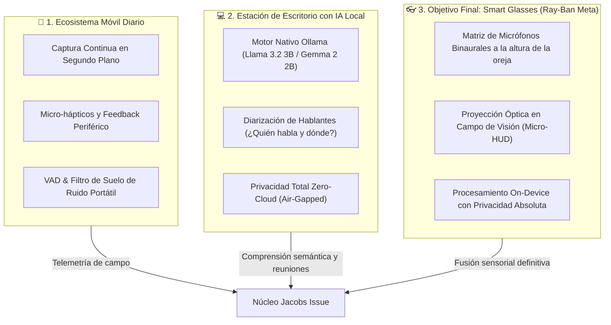

# Jacobs Issue — Documento de Visión y Objetivos Estratégicos

> **De la Detección Acústica al Ecosistema de Percepción Aumentada: Aplicación Móvil, Inteligencia Local en Escritorio y la Frontera de los Lentes Inteligentes.**

---

## 1. Declaración de Misión y Visión General

El propósito fundacional de **Jacobs Issue** es erradicar el aislamiento sensorial que experimentan las personas sordas o con pérdida auditiva (DHH) en su vida cotidiana. Aunque el prototipo inicial ha demostrado con éxito la viabilidad de un HUD PhonoSpatial de 360° en navegador mediante DSP y clasificaciones de sonido de riesgo (sirenas, alarmas, cristales rotos), el horizonte tecnológico y humano del proyecto va mucho más allá:

> **Construir un ecosistema ubicuo, privado y no invasivo que no solo detecte ruidos ambientales, sino que reconozca, individualice y localice en el espacio las diferentes voces humanas en tiempo real, culminando en una experiencia AR directa integrada en lentes inteligentes estilo Ray-Ban Meta.**

Este documento define la hoja de ruta estratégica para materializar esta visión a través de tres plataformas convergentes: **Móvil dedicada**, **Escritorio con IA local (Ollama 2–3B)** y **Wearable Óptico / Lentes Inteligentes**.

---

## 2. Los Tres Ejes de Despliegue



---

## 3. Eje I: Aplicación Móvil Dedicada al Uso Diario

Para que la asistencia acústica sea transformadora, debe acompañar al usuario en la calle, en el transporte público, en el trabajo y en el hogar sin fricciones.

### Objetivos Clave:
1. **Servicio Continuo de Bajo Consumo (Always-On Background Engine):**
   - Implementación en runtime nativo (Kotlin / Swift / Rust Core) capaz de ejecutar el rastreador de suelo de ruido adaptativo y el estimador de transitorios sin drenar la batería del terminal móvil.
   - Activación por umbral dinámico adaptativo: el sistema duerme en silencio y despierta instantáneamente ($<5\text{ ms}$) ante onsets sonoros.
2. **Hincapié en Háptica Espacial y Wearables Conectados:**
   - Comunicación con smartwatches (Apple Watch, WearOS) para emitir pulsos hápticos diferenciados:
     - **Vibración corta direccional:** Notificación de sonido advisory (ej. timbre, llamada de un conocido).
     - **Vibración de alta intensidad con pulso de choque:** Alerta de riesgo crítico (vehículo aproximándose, alarma contra incendios).
3. **Calibración Geofencing Dinámica:**
   - La app almacena perfiles acústicos de calibración (`/api/v1/calibration/baseline`) según el contexto: *Oficina silenciosa*, *Calle concurrida*, *Interior de vehículo*, ajustando los umbrales de detección sin intervención manual del usuario.

---

## 4. Eje II: Aplicación de Escritorio con IA Local Integrada (Ollama 2–3B)

En entornos de trabajo, estudio o teleconferencias (Zoom, Meet, Teams, salas de juntas), el problema no es solo alertar sobre peligros, sino **entender la dinámica acústica y conversacional del espacio**.

### Integración Local con Modelos de 2–3B (Ollama):
Para garantizar que la inteligencia artificial se ejecute de manera nativa sin enviar audio a servidores de terceros, la aplicación de escritorio integrará un motor de inferencia local:

* **Modelos Seleccionados (2B–3B):**
  - **Llama 3.2 3B / Llama 3.2 1B (Meta):** Modelo ultra optimizado para ejecución en CPUs y GPUs integradas, con una velocidad de inferencia de $>60\text{ tokens/s}$ en hardware común.
  - **Gemma 2 2B (Google DeepMind):** Excepcional capacidad de razonamiento semántico y síntesis en un footprint de memoria RAM inferior a $2\text{ GB}$.
  - **Qwen 2.5 3B:** Destacado rendimiento en tareas multilingües y comprensión contextual de diálogos fragmentados.
  - **Pipeline de Audio Front-End:** Whisper Small / Moonshine / Silero VAD embebidos en C++ / WebAssembly para transcripción fonética local ultra-rápida, alimentando al modelo Ollama para sintetizar contexto e intenciones.

### Reconocimiento y Diarización de Voces Diferenciadas:
El objetivo crítico en escritorio trasciende la detección de sonidos:
1. **Diarización de Hablantes en Tiempo Real (Speaker Diarization):**
   - El sistema analiza las huellas espectrales y fonéticas de la señal acústica para responder a la pregunta: **¿Quién está hablando en este instante?**
   - Asignación de identificadores de voz dinámicos (`Voz A`, `Voz B`, `Voz C`) o personalizados con nombres (`Mamá`, `Carlos`, `Dra. Elena`).
2. **Cruce Espacial + Diarización:**
   - Correlaciona el algoritmo GCC-PHAT con la huella vocal: *«Carlos está hablando desde el ángulo 45° a tu derecha; Elena te responde desde 270° a tu izquierda»*.
3. **Resúmenes y Filtro de Relevancia por IA Local:**
   - Si varias personas hablan de fondo, la IA local clasifica si la conversación está dirigida al usuario (mención de su nombre, inflexión vocal orientada hacia él) o si es ruido de fondo que puede atenuarse para evitar fatiga cognitiva.

---

## 5. El Objetivo Final: Lentes Inteligentes (Estilo Ray-Ban Meta / AR Eyewear)

El "endgame" indiscutible de la accesibilidad auditiva espacial son los **lentes inteligentes**. Los smartphones exigen desviar la mirada hacia una pantalla, y las pulseras hápticas carecen de dimensionalidad angular. Las gafas resuelven estos dos dilemas de forma natural:

```
[ Micrófono Izquierdo (Sien) ] ────────┐
                                      ├──> GCC-PHAT TDoA (Base 14 cm exacta) ──> Vector 3D Real
[ Micrófono Derecho (Sien) ]   ────────┘
                                                         │
                                                         ▼
[ Micro-Display Periférico / Guía de Onda ] <─── Retícula Visual Translúcida en la retina
```

### 1. Ventajas Físicas Incomparables:
* **Base Estéreo Natural (Inter-aural Spacing):** Los micrófonos integrados en las patillas de los lentes replican exactamente la distancia entre las orejas humanas (~$14-16\text{ cm}$), ofreciendo una precisión de fase GCC-PHAT matemáticamente superior a cualquier teléfono móvil.
* **Orientación Anclada a la Cabeza (Head-Tracking Nativo):** Al girar la cabeza hacia el sonido, el vector angular cambia de inmediato hacia el centro ($0^\circ$, frente), imitando la respuesta fisiológica natural de mirar hacia donde proviene la voz o el peligro.
* **Proyección Periférica No Invasiva:** Un micro-indicador de luz o display de guía de ondas (waveguide) en el borde del cristal ilumina sutilmente el cuadrante de donde proviene el sonido o la persona que habla, sin obstruir la visión del mundo real.

### 2. Privacidad Radical (Zero-Cloud Audio Policy):
La voz humana contiene datos biométricos altamente sensibles: tono emocional, estado de salud, identidades de terceros y contenido confidencial de conversaciones.

* **Procesamiento 100% On-Glass / On-Device:**
  - El audio capturado por los micrófonos de los lentes **nunca se sube a internet**.
  - Las operaciones de FFT, GCC-PHAT, dosimetría y extracción de huella de voz se ejecutan en el coprocesador de señal digital (DSP) o NPU del dispositivo.
  - La sincronización con la nube (Supabase) es puramente transaccional y opcional (ej. registrar que hubo una alarma de incendio o guardar un log de exposición a decibelios sin contenido acústico ni transcripciones privadas).
* **Cumplimiento y Confianza:**
  - Garantiza que el usuario pueda utilizar sus lentes en salas de juntas confidenciales, visitas médicas, bancos y en el hogar con la certeza técnica de que nadie está escuchando ni entrenando modelos externos con su vida privada.

### 3. Calidad de Adaptación y Ergonomía:
* **Diseño Silencioso y Transparente:** La interfaz no bombardea al usuario con datos innecesarios. Se mantiene en reposo absoluto mientras el entorno sea normal ($<65\text{ dB}$ y sin voces dirigidas).
* **Visualización Inteligente de Voces:** Al detectar una voz registrada, un sutil anillo flotante en el borde del lente destaca la posición del interlocutor y muestra una etiqueta breve o transcripción clave en su campo visual.

---

## 6. Matriz de Evolución Tecnológica

| Característica | Prototipo Actual (Web HUD) | Fase Móvil (App Diaria) | Fase Escritorio (IA Local) | Fase Final (Smart Glasses) |
| :--- | :--- | :--- | :--- | :--- |
| **Factor de Forma** | Navegador Web (PC/Móvil) | App Nativa (iOS/Android) | Desktop App (Electron/Tauri) | Gafas Inteligentes (AR/Audio) |
| **Detección Sonora** | YAMNet (521 clases) | YAMNet optimizado INT8 | YAMNet + Audio-LLM | YAMNet micro-DSP |
| **Detección de Voces** | Etiqueta genérica «Speech» | Detección de Voz Humana (VAD) | **Diarización de múltiples voces** | **Identificación vocal + Seguimiento 3D** |
| **Motor de IA** | Edge Functions Cloud | On-device TFLite | **Ollama Local (2B–3B)** | NPU integrada / Coprocesador local |
| **Visualización** | Canvas 2D + Three.js | UI adaptativa + Widgets + Wearables | HUD lateral / Ventana flotante PIP | **Micro-display AR en cristal (Waveguide)** |
| **Nivel de Privacidad** | Seguro con RLS en Supabase | Procesamiento local + Cloud opt-in | **100% Air-Gapped / Zero-Cloud** | **Biométrica protegida on-device** |
| **Latencia de Respuesta** | $\sim 45\text{ ms}$ | $\sim 20\text{ ms}$ | $\sim 15\text{ ms}$ | **$< 8\text{ ms}$ (Grado háptico/óptico)** |

---

## 7. Conclusión: Hacia una Audición Espacial Invisible

**Jacobs Issue** no aspira a ser una aplicación más en una tienda móvil; su meta es convertirse en una **prótesis sensorial invisible**. Al fusionar el rigor del procesamiento digital de señales, la potencia de modelos locales de 2–3B sin fugas de privacidad y la ergonomía insuperable de los lentes inteligentes, el proyecto redefine la autonomía para la comunidad sorda:

*No se trata solo de saber qué sonido ocurrió, sino de sentir el espacio, reconocer quién nos habla y mirar con total seguridad al mundo.*
