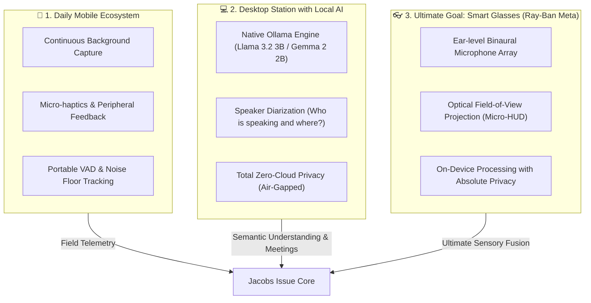

# Jacobs Issue — Strategic Vision and Objectives Document

> **From Acoustic Detection to an Augmented Perception Ecosystem: Dedicated Mobile App, Local Desktop Intelligence, and the Smart Glasses Frontier.**

---

## 1. Mission Statement and Overview

The foundational purpose of **Jacobs Issue** is to eradicate the sensory isolation experienced by deaf and hard-of-hearing (DHH) individuals in their everyday lives. While the initial prototype has successfully demonstrated the viability of a browser-based 360° PhonoSpatial HUD using DSP and risk sound classification (sirens, alarms, glass breaks), the technological and human horizon of the project extends much further:

> **To build a ubiquitous, private, and non-invasive ecosystem that not only detects environmental noises, but recognizes, individualizes, and spatially locates distinct human voices in real time, culminating in a direct AR experience integrated into Ray-Ban Meta-style smart glasses.**

This document outlines the strategic roadmap to materialize this vision across three converging platforms: **Dedicated Mobile**, **Desktop with Local AI (Ollama 2–3B)**, and **Optical Wearables / Smart Glasses**.

---

## 2. The Three Deployment Pillars



---

## 3. Pillar I: Dedicated Mobile Application for Daily Use

For acoustic assistance to be transformative, it must accompany the user seamlessly on the street, in public transit, at work, and at home.

### Key Objectives:
1. **Low-Power Continuous Service (Always-On Background Engine):**
   - Native runtime implementation (Kotlin / Swift / Rust Core) capable of running adaptive noise floor tracking and transient estimation without draining the device's battery.
   - Adaptive dynamic threshold wake-up: the system sleeps during quiet periods and wakes up instantly ($<5\text{ ms}$) upon sound onsets.
2. **Spatial Haptics and Connected Wearables:**
   - Communication with smartwatches (Apple Watch, WearOS) to deliver differentiated haptic patterns:
     - **Short directional vibration:** Advisory notification (e.g., doorbell, acquaintance calling).
     - **High-intensity shock-pulse vibration:** Critical risk alert (approaching vehicle, fire alarm).
3. **Dynamic Geofencing Calibration:**
   - The app stores acoustic calibration profiles (`/api/v1/calibration/baseline`) according to context: *Quiet Office*, *Busy Street*, *Vehicle Interior*, adjusting detection thresholds without requiring manual user intervention.

---

## 4. Pillar II: Desktop Application with Integrated Local AI (Ollama 2–3B)

In work, academic, or video conference environments (Zoom, Meet, Teams, boardrooms), the challenge is not merely alerting to hazards, but **understanding the acoustic and conversational dynamics of the room**.

### Local Integration with 2–3B Models (Ollama):
To ensure artificial intelligence runs natively without routing audio to third-party cloud servers, the desktop app integrates a local inference engine:

* **Selected Models (2B–3B):**
  - **Llama 3.2 3B / Llama 3.2 1B (Meta):** Ultra-optimized model for CPU and integrated GPU execution, delivering inference speeds $>60\text{ tokens/s}$ on standard consumer hardware.
  - **Gemma 2 2B (Google DeepMind):** Exceptional semantic reasoning and summarization capabilities within a RAM footprint of less than $2\text{ GB}$.
  - **Qwen 2.5 3B:** Outstanding performance in multilingual tasks and contextual comprehension of fragmented dialogues.
  - **Front-End Audio Pipeline:** Whisper Small / Moonshine / Silero VAD embedded via C++ / WebAssembly for ultra-fast local phonetic transcription, feeding the Ollama model to synthesize context and intent.

### Distinct Voice Recognition and Speaker Diarization:
The critical desktop objective transcends simple sound detection:
1. **Real-Time Speaker Diarization:**
   - The system analyzes spectral and phonetic signatures of the acoustic signal to answer: **Who is speaking right now?**
   - Dynamic voice identification (`Voice A`, `Voice B`, `Voice C`) or custom contact naming (`Mom`, `Carlos`, `Dr. Elena`).
2. **Spatial Correlation + Diarization:**
   - Cross-references the GCC-PHAT algorithm with the vocal print: *"Carlos is speaking from 45° to your right; Elena responds from 270° to your left"*.
3. **Local AI Summaries and Relevance Filtering:**
   - When multiple voices overlap in the background, the local AI determines whether dialogue is addressed to the user (name mentions, vocal inflection directed forward) or background chatter that can be dampened to mitigate cognitive fatigue.

---

## 5. The Ultimate Goal: Smart Glasses (Ray-Ban Meta Style / AR Eyewear)

The indisputable endgame for spatial acoustic accessibility is **smart glasses**. Smartphones require diverting gaze toward a handheld screen, and haptic bands lack precise angular dimensionality. Eyewear naturally resolves both challenges:

```
[ Left Temple Microphone ] ─────────┐
                                    ├──> GCC-PHAT TDoA (Exact 14 cm Baseline) ──> Real 3D Vector
[ Right Temple Microphone ] ────────┘
                                                         │
                                                         ▼
[ Peripheral Micro-Display / Waveguide ] <─── Translucent Visual Reticle on Retina
```

### 1. Incomparable Physical Advantages:
* **Natural Stereo Baseline (Inter-aural Spacing):** Microphones built into the frames replicate the natural human inter-ear distance (~$14-16\text{ cm}$), providing mathematically superior GCC-PHAT phase accuracy compared to any mobile phone.
* **Head-Mounted Orientation (Native Head-Tracking):** As the user turns their head toward the sound, the angular vector immediately shifts toward center ($0^\circ$, straight ahead), mirroring the instinctive physiological response of looking toward the source of voice or danger.
* **Non-Invasive Peripheral Projection:** A micro-LED or optical waveguide display at the edge of the lens subtly illuminates the quadrant where the sound or speaker is located, without obstructing real-world vision.

### 2. Radical Privacy (Zero-Cloud Audio Policy):
Human voice carries highly sensitive biometric data: emotional state, health indicators, third-party identities, and confidential conversational content.

* **100% On-Glass / On-Device Processing:**
  - Raw audio captured by the eyewear microphones **is never uploaded to the internet**.
  - FFT, GCC-PHAT, dosimetry, and voiceprint extraction run entirely on the device's DSP or NPU.
  - Cloud synchronization (Supabase) is strictly transactional and opt-in (e.g., logging that a fire alarm occurred or recording decibel exposure metrics without raw acoustics or private transcripts).
* **Compliance and Trust:**
  - Enables users to wear their smart glasses in confidential meetings, medical consultations, banking environments, and at home with the technical certainty that no remote server is listening or training models on their personal life.

### 3. Ergonomics and Adaptation Quality:
* **Quiet, Transparent Design:** The interface avoids visual overload. It remains completely idle during ordinary ambient conditions ($<65\text{ dB}$ and no speech directed at user).
* **Intelligent Voice Visualization:** Upon detecting a registered voice, a subtle floating ring at the lens periphery highlights the speaker's location and renders a concise tag or key transcription within the visual field.

---

## 6. Technological Evolution Matrix

| Feature | Current Prototype (Web HUD) | Mobile Phase (Daily App) | Desktop Phase (Local AI) | Final Phase (Smart Glasses) |
| :--- | :--- | :--- | :--- | :--- |
| **Form Factor** | Web Browser (PC/Mobile) | Native App (iOS/Android) | Desktop App (Electron/Tauri) | Smart Glasses (AR/Audio) |
| **Sound Detection** | YAMNet (521 classes) | Optimized YAMNet INT8 | YAMNet + Audio-LLM | YAMNet micro-DSP |
| **Voice Detection** | Generic "Speech" label | Human Voice Activity (VAD) | **Multi-speaker Diarization** | **Voice Identification + 3D Tracking** |
| **AI Engine** | Cloud Edge Functions | On-device TFLite | **Local Ollama (2B–3B)** | Integrated NPU / Local Coprocessor |
| **Visualization** | 2D Canvas + Three.js | Adaptive UI + Widgets + Wearables | Side HUD / Floating PIP Window | **Waveguide AR Micro-display** |
| **Privacy Level** | Secure with Supabase RLS | Local processing + Opt-in Cloud | **100% Air-Gapped / Zero-Cloud** | **On-device Protected Biometrics** |
| **Response Latency** | $\sim 45\text{ ms}$ | $\sim 20\text{ ms}$ | $\sim 15\text{ ms}$ | **$< 8\text{ ms}$ (Haptic/Optical Grade)** |

---

## 7. Conclusion: Toward Invisible Spatial Hearing

**Jacobs Issue** is not merely another mobile application; its ultimate purpose is to become an **invisible sensory prosthesis**. By uniting rigorous digital signal processing, the power of local 2–3B models without privacy leaks, and the unmatched ergonomics of smart eyewear, the project redefines autonomy for the deaf and hard-of-hearing community:

*It is not just about knowing what sound happened, but about feeling space, recognizing who is speaking to us, and facing the world with complete confidence.*
